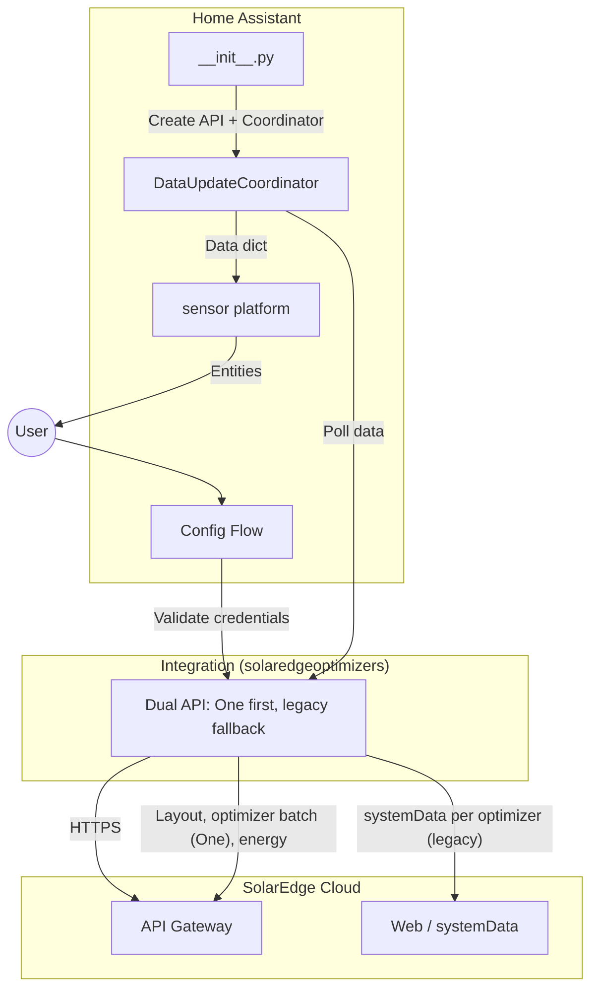
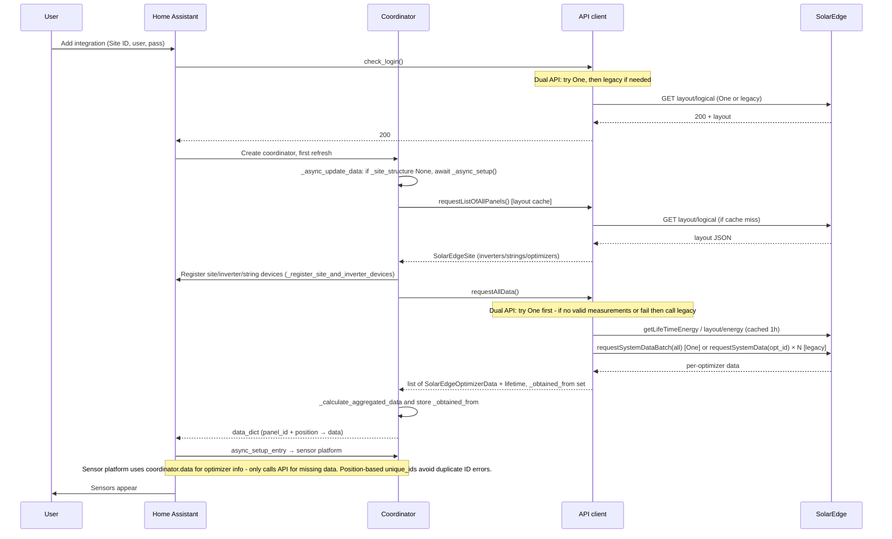
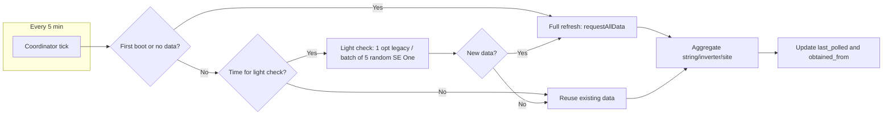

# SolarEdge Optimizers – Technical Documentation

**Full documentation for the SolarEdge Optimizers Home Assistant integration.**  
Use this as the main wiki page or copy sections into your GitHub wiki.

---

## Table of contents

1. [Overview](#1-overview)
2. [Architecture](#2-architecture)
3. [Device and entity hierarchy](#3-device-and-entity-hierarchy)
4. [Data flow and polling](#4-data-flow-and-polling)
5. [Installation](#5-installation)
6. [Configuration](#6-configuration)
7. [Sensors and entities reference](#7-sensors-and-entities-reference)
8. [Update behaviour and caches](#8-update-behaviour-and-caches)
9. [Inactive devices](#9-inactive-devices)
10. [Offline and stale data handling](#10-offline-and-stale-data-handling)
11. [Internationalization (i18n)](#11-internationalization-i18n)
12. [API client and SolarEdge portal](#12-api-client-and-solaredge-portal)
13. [Troubleshooting and logging](#13-troubleshooting-and-logging)
14. [File structure and constants](#14-file-structure-and-constants)
15. [Credits and links](#15-credits-and-links)

---

## 1. Overview

The **SolarEdge Optimizers** integration pulls data from the SolarEdge monitoring portal into Home Assistant. It exposes:

- **Per-optimizer (per-panel)** sensors: voltage, current, optimizer voltage, power,
  maximum daily temperature (SolarEdge One only), lifetime energy, last measurement,
  status, azimuth, and tilt.
- **Aggregated** sensors at **string**, **inverter**, and **site** level: current (average), voltage (average), power, lifetime energy, last measurement, child counts (optimizer/string/inverter count), and status (strings and inverters only). At **inverter** level (SolarEdge One): **Max active power** in kW (from portal layout logical v2, same cache as layout). At **site** level only (SolarEdge One): **Installation date** and **Peak power** (from portal layout/information/site).
- A **Last polled** sensor and an **Obtained from** sensor on the site device (last polled = when the integration last fetched data; obtained from = "One API" or "Legacy API" depending on which source provided the current data).

### Features

- **Config flow**
  - Single-step setup: Site ID, username, password, optional Entity ID prefix,
    optional Include Site ID in Entity ID, Use SolarEdge One (default on).
  - Field order: site ID → username → password → Entity ID prefix →
    Include Site ID in Entity ID → Use SolarEdge One.
  - One config entry per site; validation succeeds if either One or legacy login is 200.
- **Re-authentication**
  - When API returns 401, the integration raises `ConfigEntryAuthFailed`.
  - Home Assistant shows a re-auth form (username/password).
  - Only credentials are updated; options are preserved.
- **Update credentials (Reconfigure)** (v2.4.20+)
  - Integration menu (⋮) → **Update credentials** (`config.initiate_flow.reconfigure`) opens username/password update without deleting the entry.
  - **Configure** cog → **Reconfigure {title}** is the options flow for Entity ID prefix / Include Site ID / Use SolarEdge One only.
- **Options (Configure)**
  - Prefix, Include Site ID, and Use SolarEdge One are configurable without removal.
  - Saving reloads the integration.
  - Changing prefix/include-site-id can change `entity_id` and `unique_id`.
- **Cloud polling**: Uses SolarEdge cloud APIs only; no local discovery.
- **Adaptive polling**
  - Coordinator runs every 5 minutes (`UPDATE_DELAY`).
  - Lightweight checks run on fresh/stale intervals (5 min / 30 min).
  - Full refresh triggers on first boot, new data, or periodic re-try from legacy.
- **Optimizer live data (full refresh)**
  - One API: one batch POST (all serials).
  - Legacy API: parallel per-optimizer requests.
- **Sensor setup optimization**
  - Sensor setup reuses `coordinator.data` and only fetches missing optimizers.
- **Caching**
  - Layout: 2 h (`PANELS_CACHE_TTL_ONE` / `PANELS_CACHE_TTL_LEGACY`).
  - Site info (One): 2 h (`SITE_INFO_CACHE_TTL`).
  - Lifetime energy: 1 h (`LIFETIME_ENERGY_CACHE_TTL`).
  - Temperatures (One): 30 min (`TEMPERATURE_CACHE_TTL`).
- **Multi-language**: Config flow and entity labels translated; API locale follows HA language.
- **Stale handling**
  - Live V/I/P zeroed when measurement age exceeds threshold
    (1 h for One, 2 h for legacy).
  - Source is visible in **Obtained from**.
- **Reliability**
  - Handles temporary server/network failures with cache fallback.
  - Closes One + legacy sessions/connections on unload/removal.
  - Uses request timeouts (`API_TIMEOUT_SHORT`, `API_TIMEOUT_LONG`) and retry paths.
- **Removal cleanup**
  - `async_remove_entry` closes API client and removes registry entities/devices
    via shared helper.
- **Hardware replacement**
  - Identity is position-based (not serial-based), so replacement hardware updates
    existing logical entities.
- **Duplicate name handling**
  - Duplicate names are suffixed (`a`, `b`, `c`), with active devices ordered first.

### Requirements

- **Home Assistant** (tested with recent versions; Core **2026.8.1+** supported).
- **Current version:** **2.4.21** (`manifest.json`).
- **SolarEdge monitoring account**: Site ID, username (email), password.
- **Network**: Outbound HTTPS to `monitoring.solaredge.com` (legacy and SolarEdge One both use this host; SolarEdge One also uses `login.solaredge.com` for OAuth).
- **Python dependency**: none declared in `manifest.json` (legacy decode uses stdlib `json` only; `requests` / `pytz` come from the Home Assistant environment). Older builds that listed `jsonfinder==0.4.2` can fail setup on Core 2026.8.1+ with `Requirements for solaredgeoptimizers not found` — upgrade to **v2.4.21+**.

---

## 2. Architecture

High-level components and how they interact:



### Component roles

- **Config flow**
  - Collects Site ID, username, password, and options.
  - Validates through dual API `check_login()` (One or legacy can succeed).
  - Creates translated entry title and handles shared cleanup on remove.
- **`__init__.py`**
  - Migrates missing `use_solaredge_one` to default True.
  - Creates dual API and coordinator, runs first refresh, forwards platforms.
  - Contains shared entity/device registry cleanup helper.
- **Coordinator**
  - Runs every 5 minutes (`UPDATE_DELAY`) with adaptive polling.
  - Forces periodic One re-try when currently on legacy.
  - Refreshes temperatures on no-full-refresh cycles (One API).
  - Builds serial + position keyed data and computes aggregates.
  - Exposes `_obtained_from` and uses `SolarEdgeAPIProtocol`.
- **Sensor platform**
  - Rebuilds registry entities only when entity-id shape options changed.
  - Registers **optimizer** devices before entities (`_register_optimizer_devices`); site/inverter/string devices come from the coordinator.
  - Adds sensors in batches (`ENTITY_ADD_BATCH_SIZE`) and notifies coordinator listeners after the last batch.
  - Parses display-name suffixes (e.g. `1.1.1a`) via `build_optimizer_tasks` / `parse_optimizer_display_name_to_indices`.
  - Uses coordinator cache first and fetches only missing optimizer data.
- **API client**
  - Dual API (`api_dual.py`) tries One first and falls back to legacy.
  - `use_solaredge_one=False` forces legacy-only mode.
  - Exposes source label (`_obtained_from`) and supports cached layout/energy paths.

---

## 3. Device and entity hierarchy

How the physical layout maps to Home Assistant devices and entities:

```mermaid
flowchart TD
    subgraph Site[Site device]
        LP[Last polled]
        OF[Obtained from]
        S_P[Power]
        S_V[Voltage average]
        S_C[Current average]
        S_E[Lifetime energy]
        S_L[Last measurement]
        S_I[Inverter count]
        S_ID[Installation date]
        S_PP[Peak power]
    end

    subgraph Inv[Inverter device]
        I_P[Power]
        I_V[Voltage average]
        I_C[Current average]
        I_E[Lifetime energy]
        I_L[Last measurement]
        I_S[String count]
        I_ST[Status]
        I_MAP[Max active power]
    end

    subgraph Str[String device]
        R_P[Power]
        R_V[Voltage average]
        R_C[Current average]
        R_E[Lifetime energy]
        R_L[Last measurement]
        R_O[Optimizer count]
        R_ST[Status]
    end

    subgraph Opt[Optimizer device]
        O_P[Power]
        O_V[Voltage]
        O_C[Current]
        O_OV[Optimizer voltage]
        O_T[Temperature]
        O_E[Lifetime energy]
        O_L[Last measurement]
        O_S[Status]
        O_AZ[Azimuth]
        O_TI[Tilt]
    end

    Site --> Inv
    Inv --> Str
    Str --> Opt
```



- **Site** → **Inverters** → **Strings** → **Optimizers**.  
- **Device names** include the site so multiple sites don’t clash:
  **Site [site]**, **Inverter [site].[i]**, **String [site].[i].[s]**,
  **Optimizer [site].[i].[s].[o]**
  (e.g. Site 9999999, Inverter 9999999.1, String 9999999.1.1, Optimizer 9999999.1.1.1).  
- **Device model and serial:** When using **SolarEdge One**, each **optimizer** device
  shows the optimizer **model** (e.g. P405-4RM4MRM-NA25) and serial number from the API.
  When the API provides a **panel type** (description, e.g. SunPower SPR-MAX3-400),
  it is appended to the device model
  (e.g. P405-4RM4MRM-NA25 - SunPower SPR-MAX3-400) and exposed as a **panel_type**
  attribute on optimizer sensors. Each **inverter** device shows the inverter **model**
  (e.g. SE5000H-RW000BNN4, from `fullModel`) and serial number. Legacy API does not
  fetch model for inverters; optimizer model may come from layout where available.  
- **Device identity:** At **string and optimizer** level, device names and entity IDs
  are **based on the API display name** when it parses (e.g. "1.0", "1.0.1"); if the
  display name does not parse, position-based indices are used. Site and inverter stay
  position-based. Devices and sensor data are keyed by logical position (not serial
  number). The coordinator creates site, inverter, and string devices with these
  identifiers; the sensor platform attaches **aggregated** (string/inverter) sensors to
  the same devices so the hierarchy (site → inverter → string → optimizer) is correct
  (from v2.4.17, no “non existing via_device” startup warning when devices are pre-registered).
  When an optimizer or
  inverter is replaced (hardware swap), the same device and sensors show the new unit’s
  data after the next refresh; no duplicate entities. Device identifiers use
  `entry_id_inv_{i}`, `entry_id_str_{i}_{s}`, `entry_id_opt_{i}_{s}_{o}`.
  For string/optimizer, indices come from the parsed API display name when available,
  so identity stays stable across hardware replacement.  
- **Entity IDs** follow a path that may or may not include the site ID, depending on
  **Include SiteID in EntityID** (default off). When off: site level always has the
  site ID (e.g. `sensor.[base]power_[site]`); inverter/string/optimizer levels omit it
  (e.g. `sensor.[base]power_[i]_[s]_[o]`). When on: all levels include the site ID
  (e.g. `sensor.[base]power_[site]_[i]_[s]_[o]`).
  At string/optimizer level the path reflects the API display name when it parses
  (e.g. 1_0, 1_0_1). *[base]* is the optional Entity ID prefix from config.
  **Per-optimizer** sensors use `has_entity_name=False` and a full path-based
  `suggested_object_id`, so Home Assistant does **not** prepend the optimizer device
  slug to the entity id (avoiding ids like `sensor.optimizer_1_1_1_power_1_1_1`).
  Friendly names for optimizers are the short translated sensor label only
  (e.g. “Power”, “Azimuth”) in `async_added_to_hass`; the optimizer device name carries
  site/string/optimizer context. Aggregated sensors still use short translated names
  with `has_entity_name=True`. Entity IDs have no redundant device-name prefix.  
- In **Settings → Devices & services**, “Connected via” shows the parent (e.g. optimizer → string, string → inverter). Optimizers are grouped under their string device.  
- Entity names: aggregated sensors use short translated labels (e.g. “Power”) with the device name; per-optimizer sensors use the same short labels (e.g. “Power”, “Azimuth”) with the optimizer device name for context.

---

## 4. Data flow and polling

### Setup (first load)



### Ongoing updates (adaptive polling)



**Note:** A full refresh is also triggered when data is from legacy and at least
30 minutes have passed since the last full refresh (re-try One so the integration can
switch back). When the coordinator **reuses** existing data (no full refresh), it still
refreshes optimizer maximum daily temperatures if the API supports it (e.g. SolarEdge One) via
`_refresh_temperature_when_no_full_refresh()`, using
`get_optimizer_temperatures_cached()` so temperatures stay updated when the temperature
cache expires (30 min, `TEMPERATURE_CACHE_TTL`).

- **Light check interval**: About **5 minutes** when data is recent
  (`LIGHT_CHECK_DESIRED_INTERVAL_FRESH`); about **30 minutes** when data is old or
  missing (`LIGHT_CHECK_DESIRED_INTERVAL_STALE`). A full refresh is not triggered again
  within **5 minutes** of the last one (`LIGHT_CHECK_MIN_INTERVAL`).  
- **Light check strategy**: Which API is used follows the **last full refresh**.
  When the dual API last used **legacy** for full data, the light check uses a single
  representative optimizer (`requestSystemData`). When it last used **SolarEdge One**,
  the light check uses up to `LIGHT_CHECK_BATCH_SIZE` (5) optimizers chosen at random;
  one batch request (`requestSystemDataBatch`) returns live data for all of them.
  The sample is **rotated each light check** (v2.4.21+) so a fixed shaded/faulty panel
  does not stall detection. If any has a newer `lastMeasurement` than the coordinator’s
  latest, a full refresh is triggered. Auth-like failures during the light check raise
  `ConfigEntryAuthFailed` (same as full refresh) so credentials are not silently stale.
- **Full refresh**: Coordinator calls the dual API's `requestAllData()`: dual API tries
  One first; if no valid measurements or fail, uses legacy; sets `_obtained_from`.
  **SolarEdge One** fetches optimizer live data in one batch POST
  (`requestSystemDataBatch` with all serials); **legacy** uses parallel per-optimizer
  requests. Lifetime energy comes from cache when possible. When data is currently from
  **legacy** (`_obtained_from` = Legacy API), the coordinator forces a full refresh
  every **30 minutes** (`REVERT_TO_ONE_RETRY_INTERVAL` in `const.py`) so One is re-tried
  and the integration can switch back when One is available.  
- **Lifetime energy**: Dual API's `get_lifetime_energy_cached()` returns the cache from
  whichever API was last used for full data (One or legacy). TTL 1 hour; aggregations
  come from that cache.  
- **Sensor setup**: After the coordinator’s first refresh, the sensor platform receives
  `data_dict` and uses it for optimizer info when creating entities; it only calls the
  API for optimizers missing from that data, so setup avoids duplicate fetches and is
  faster.

---

## 5. Installation

### Via HACS (recommended)

1. **HACS** → **Custom repositories** → add `https://github.com/AndrewTapp/solaredgeoptimizers` as **Integration**.  
2. **Integrations** → find **SolarEdge Optimizers** → **Download**.  
3. **Restart Home Assistant.**  
4. **Settings** → **Devices & services** → **Add Integration** → search **SolarEdge Optimizers**.

### Manual

1. Clone or download the repo into `custom_components/solaredgeoptimizers/`.  
2. Restart Home Assistant.  
3. Add the integration as above.

Ensure `custom_components/solaredgeoptimizers/` contains at least: `__init__.py`, `api.py`, `api_dual.py`, `config_flow.py`, `const.py`, `coordinator.py`, `exceptions.py`, `manifest.json`, `sensor.py`, `solaredgeoptimizers.py`, `solaredge_one_api.py`, `strings.json`, and the `translations/` folder.

---

## 6. Configuration

- **Single step**
  - Site ID, Username (email), Password, optional **Entity ID prefix**,
    optional **Include Site ID in Entity ID** (default **off**), and optional
    **Use SolarEdge One** (default **on**).
  - Field order: Site ID → Username → Password → Entity ID prefix →
    Include Site ID in Entity ID → Use SolarEdge One.  
- **Use SolarEdge One**
  - Optional, default **on**.
  - **Yes** = dual API mode; **No** = legacy-only mode.
  - Stored in data on first setup and changeable from Configure.
  - Migration sets default True when missing.
- **Dual API** (when Use SolarEdge One is on)
  - Tries **SolarEdge One API** first (`monitoring.solaredge.com/services/layout/...`).
  - Falls back to **legacy** when One has no valid measurements or login fails.
  - Retries One periodically when currently on legacy (full refresh cadence).
  - Site-level **Obtained from** reports "One API" or "Legacy API".
  - One API populates model/panel type metadata when available.
  - Validation succeeds when either backend returns 200.
- **One config entry per site**
  - Config flow sets `unique_id` to Site ID.
  - Duplicate Site ID entries are aborted.
- **Entity ID prefix**
  - Optional (e.g. `se_`), normalized to lowercase + underscores.
  - Leave blank for no prefix.
  - Useful for multi-site setups or namespace separation.
- **Include Site ID in Entity ID**
  - Optional, default **off**.
  - Off: inverter/string/optimizer IDs omit site ID.
  - On: all levels include site ID in ID path.
- **Validation**: Uses dual API `check_login()`: tries SolarEdge One first, then legacy; success if either returns 200.  
- **Config entry title**: Translated, e.g. “SolarEdge Site 12345” (from `config.title_entry` with `%(siteid)s`).  
- **Errors**: “Failed to connect”, “Invalid authentication”, “Unexpected error” (keys `cannot_connect`, `invalid_auth`, `unknown`); all translatable.  
- **Abort**: “Device is already configured” when the same site is already set up; "Re-authentication successful" and "Re-authentication could not find the config entry." for the re-auth flow (all translatable).  
- **Re-authentication**
  - Invalid credentials raise `ConfigEntryAuthFailed` during setup, reload, or coordinator polling (v2.4.20+).
  - Home Assistant shows a re-auth form (username/password) on the integration card.
  - Flow uses `async_step_reauth` → `async_step_reauth_confirm`.
  - Reauth updates username/password only; options stay unchanged.
  - Abort reasons: `reauth_successful`, `reauth_entry_missing`.
- **Update credentials (Reconfigure)** (v2.4.20+)
  - Integration menu (⋮) → **Update credentials** (`config.initiate_flow.reconfigure`) opens `async_step_reconfigure`.
  - Same username/password validation as reauth; options unchanged.
  - Abort reasons: `reconfigure_successful`, `reconfigure_entry_missing`.
  - **Configure** (options flow) is for Entity ID prefix / Include Site ID / Use SolarEdge One only — not credentials.
- **Options (Configure)**
  - Configure allows changing Entity ID prefix / Include Site ID / Use SolarEdge One.
  - Form strings come from `options.step.init.*`.
  - Values are stored in `entry.options` and override `entry.data`.
  - Saving updates options and reloads the entry.
  - Changing entity-ID-shape options can create new entity IDs/unique IDs and may
    break history/statistics continuity.

No YAML configuration is required; all configuration is via the config flow.

---

## 7. Sensors and entities reference

### Per-optimizer (individual panel)

| Sensor | Device class | Unit | Description |
|--------|--------------|------|-------------|
| Power | power | W | Instantaneous power. |
| Voltage | voltage | V | Panel voltage. |
| Current | current | A | Panel current. |
| Optimizer voltage | voltage | V | Optimizer output voltage. |
| Temperature | temperature | °C | Optimizer maximum daily temperature from SolarEdge One API (layout/energy by-inverter with `include-max-temperature`). Portal may send °C or °F (`temperatureUnit`); integration converts to °C for storage; HA displays in your preferred unit. Only available when using One API; shows “unknown” when missing or when using legacy API. Refreshed when the temperature cache expires (30 min, `TEMPERATURE_CACHE_TTL`) even when the coordinator does not do a full refresh. Not zeroed when stale. |
| Lifetime energy | energy | kWh | Total energy (monotonic). Sourced from the API’s `unscaledEnergy` (Wh); the portal’s `units` field applies only to display values `energy` and `moduleEnergy`. **Site** lifetime uses the portal's dashboard production (Wh) when available (v2.4.21+: no layout-sum fallback when the dashboard helper exists). **Inverter** and **string** use the portal’s layout/energy by-inverter (Wh) when > aggregated, with string buckets paired to layout strings by sorted **relativeOrder** / portal keys. Override skipped when aggregated Wh is 0 or portal Wh exceeds the aggregate by more than **STRING_LIFETIME_PORTAL_OVERRIDE_MAX_RATIO** (default 3×; applies to string **and** inverter from v2.4.21). Start date = installation date from layout/information/site. |
| Last measurement | timestamp | — | Time of last measurement from portal (`lastMeasurement` / `lastMeasurementDate`). May be absent or blank. For **inactive** optimizers the API often omits this; the integration preserves the previous value across refreshes so the sensor shows when the optimizer was last updated (or unknown on first load). |
| Status | — | — | Optimizer status from API. **Blank** (empty) is treated as active and displayed as **blank** with the active icon. Shown in proper case: "Active", "Inactive", or raw value for any other status. Icon: check-circle for Active/blank, alert-circle for Inactive, help-circle for unknown. |
| Azimuth | — | ° | Panel compass direction (0–360°), converted from radians. Only available when API provides module orientation data. Icon: compass. |
| Tilt | — | ° | Panel angle from horizontal in degrees, converted from radians. Only available when API provides module orientation data. Icon: angle-acute. |

- **Panel type (attribute):** When the SolarEdge One API provides a description (panel type, e.g. SunPower SPR-MAX3-400), it is exposed as a **panel_type** attribute on each optimizer sensor and included in the optimizer device model. Entity IDs are unchanged.

- **Stale rule**: If last measurement is older than the threshold (**1 h** when data is from One API, **2 h** when from Legacy API—see **Obtained from** sensor), **Power, Voltage, Current, Optimizer voltage** are shown as **0**. **Temperature** (when from SolarEdge One) is not zeroed; it shows the last known value or unknown if missing. Lifetime energy, Last measurement, Status, Azimuth, and Tilt always show last known value.

### Per-string (aggregated)

| Sensor | Description |
|--------|--------------|
| Power | Sum of optimizer power (with recent data). |
| Current (average) | Average current of optimizers with recent data. |
| Voltage (average) | Average voltage of optimizers with recent data. |
| Lifetime energy | Sum of optimizer lifetime energy (from API, by string; uses `unscaledEnergy` in Wh). Site level: uses portal dashboard production (Wh) when > aggregated; inverter/string use portal by-inverter (Wh) when > aggregated (string keys aligned by layout order; skip override if portal Wh ≫ optimizer sum—see per-optimizer table); start date = installation date from site info. |
| Last measurement | Latest **last measurement** among **active** optimizers on the string (blank/Active status). Unknown if none have a timestamp. |
| Optimizer count | Number of **active** (status blank or "Active") optimizers in the string (always an integer). |
| Status | String status from API. Blank → "blank" (active icon); "Inactive" → Inactive (inactive icon); other → raw value (unknown icon). |

### Per-inverter (aggregated)

| Sensor | Description |
|--------|--------------|
| Power | Sum of string power. |
| Current (average) / Voltage (average) | Averages over strings with recent data. |
| Lifetime energy | Sum of string lifetime energy. |
| Last measurement | Latest among **active** strings on the inverter. Unknown if none qualify. |
| String count | Number of **active** (status blank or "Active") strings under the inverter (always an integer). |
| Status | Inverter status from API. Blank → "blank" (active icon); "Inactive" → Inactive (inactive icon); other → raw value (unknown icon). |
| **Max active power** | (Inverter only, SolarEdge One.) Inverter maximum active power in kW (from portal layout logical v2, `maxActivePower` in watts displayed as kW). Entity ID: `sensor.[prefix]max_active_power_[site]_[inverter]` or `sensor.[prefix]max_active_power_[inverter]` when site ID is not in entity IDs. Same cache as layout (2 h). |

### Per-site (aggregated)

| Sensor | Description |
|--------|--------------|
| Same as inverter | But over all inverters. **Last measurement:** latest among **active** inverters; unknown if none qualify. |
| Inverter count | Number of **active** (status blank or "Active") inverters (always an integer). |
| **Last polled** | (Site device only.) When the integration last successfully finished an update. |
| **Obtained from** | (Site device only.) Which API provided the current data: **"One API"** or **"Legacy API"**. Entity ID: `sensor.[prefix]obtained_from_[site]` or `sensor.[prefix]obtained_from` when site ID is not included in entity IDs. |
| **Installation date** | (Site only, SolarEdge One.) Date the site was installed (from portal layout/information/site). Entity ID: `sensor.[prefix]installation_date_[site]` or `sensor.[prefix]installation_date` when site ID is not in entity IDs. |
| **Peak power** | (Site only, SolarEdge One.) Site peak power in kW (from portal layout/information/site). Entity ID: `sensor.[prefix]peak_power_[site]` or `sensor.[prefix]peak_power` when site ID is not in entity IDs. |

All aggregated sensors use the same naming pattern (e.g. “Power”, “Current (average)”) with the device name indicating the level. Entity IDs include the path so they are unique. When **Include Site ID in Entity ID** is **off** (default), inverter/string/optimizer IDs omit the site; site level and Last polled always show the site ID. When **on**, all levels include the site ID.

| Level    | Example (prefix blank, Include SiteID **off**) | Example (prefix blank, Include SiteID **on**) |
|----------|------------------------------------------------|-----------------------------------------------|
| Site     | `sensor.power_9999999`                         | `sensor.power_9999999`                        |
| Inverter | `sensor.power_1`                               | `sensor.power_9999999_1`                      |
| String   | `sensor.power_1_1`                             | `sensor.power_9999999_1_1`                    |
| Optimizer| `sensor.power_1_1_1`, `sensor.temperature_1_1_1` | `sensor.power_9999999_1_1_1`, `sensor.temperature_9999999_1_1_1` |
| Last polled | `sensor.last_polled`                        | `sensor.last_polled_9999999`                  |
| Obtained from | `sensor.obtained_from`                    | `sensor.obtained_from_9999999`                |

Child-count sensors: `inverter_count` at site level, `string_count` at inverter level, and `optimizer_count` at string level, with the same path suffix.

---

## 8. Update behaviour and caches

| Item | Interval / TTL | Notes |
|------|----------------|--------|
| Coordinator tick | 5 minutes | `UPDATE_DELAY` in `const.py`. |
| Light check | ~5 min (recent data) or ~30 min (old/none) | Desired interval: `LIGHT_CHECK_DESIRED_INTERVAL_FRESH` (5 min) when data fresh, `LIGHT_CHECK_DESIRED_INTERVAL_STALE` (30 min) when stale/missing. Full refresh not retriggered within `LIGHT_CHECK_MIN_INTERVAL` (5 min). When last full data was from **legacy:** single optimizer `requestSystemData`. When from **SolarEdge One:** up to `LIGHT_CHECK_BATCH_SIZE` (5) optimizers at random, one `requestSystemDataBatch`; if any has newer data, full refresh. |
| Full refresh | When light check sees new data, first boot / no data, or **every 30 min when data is from legacy** (re-try One) | Dual API `requestAllData()`: tries One first; if no valid measurements or fail, uses legacy. Returns all optimizers + lifetime energy; sets `_obtained_from`. **SolarEdge One:** optimizer live data via **one batch POST** (`requestSystemDataBatch` with all serials); when the lifetime-energy cache is cold, `get_lifetime_energy_cached()` fetches per-optimizer energy in **parallel** (thread pool, up to `MAX_PARALLEL_WORKERS` = 10). **Legacy:** parallel per-optimizer requests for live data. `REVERT_TO_ONE_RETRY_INTERVAL` = 30 min. **Timeout:** 30 minutes (`COORDINATOR_REFRESH_TIMEOUT_SEC`, 1800 s). |
| Layout (panels) cache | 2 h (One and legacy) | One API: `PANELS_CACHE_TTL_ONE` (2 h). Legacy: `PANELS_CACHE_TTL_LEGACY` (2 h). `requestListOfAllPanels()` (dual API prefers One; fallback legacy). |
| Site info cache (One only) | 2 hours | `SITE_INFO_CACHE_TTL`. Installation date and peak power from `get_site_info_cached()` (layout/information/site). Used for site-level sensors and as start date for portal lifetime calls. Inverter **Max active power** comes from the layout (logical v2); same 2 h layout cache. |
| Lifetime energy cache | 1 hour | `LIFETIME_ENERGY_CACHE_TTL`. Dual API `get_lifetime_energy_cached()` returns cache from the API that was last used for full data (One or legacy). **SolarEdge One:** on cache miss, per-optimizer energy-graph requests run in parallel (thread pool). Converted to kWh from `unscaledEnergy` (Wh); `units` applies only to display fields. |
| Optimizer temperatures cache (One only) | 30 minutes | `TEMPERATURE_CACHE_TTL`. SolarEdge One `get_optimizer_temperatures_cached()`; layout/energy by-inverter with `include-max-temperature=true`. API may return °C or °F per `temperatureUnit`; integration normalizes to °C. The value is the optimizer **maximum daily temperature**. When the coordinator does **not** do a full refresh (e.g. reuses data after a light check), it still calls `_refresh_temperature_when_no_full_refresh()`, which uses this cache so optimizer maximum daily temperatures are updated when the cache expires (30 min) even when power/voltage are not. Merged into optimizer data on full refresh and on this optional refresh. Debug: when unit is Fahrenheit, logs per-optimizer conversion (raw °F → °C) and summary count. |
| Full-refresh cooldown | 5 minutes | `LIGHT_CHECK_MIN_INTERVAL` in `const.py`; avoids triggering a full refresh again within 5 minutes of the last full refresh when the light check detects new data. |

Aggregations (string/inverter/site) are computed in the coordinator from optimizer data and cached lifetime energy; they are not separate API calls. **Site lifetime energy** uses the portal's dashboard production (Wh) when it is greater than the aggregated total; **inverter** and **string** use the portal's layout/energy by-inverter (Wh) when greater than their aggregated totals, with per-string portal values mapped by pairing sorted layout **relativeOrder** with sorted portal **stringRelativeOrder** keys (fallback: enumerate index). If portal string Wh exceeds the optimizer aggregate by more than **STRING_LIFETIME_PORTAL_OVERRIDE_MAX_RATIO** (see `const.py`), the string-level override is skipped. **Last measurement** at string/inverter/site is the latest timestamp among **active** children at that level only; aggregated sensors may be unknown when no child supplies a time. The start date for portal lifetime calls is the site **installation date** from `get_site_info_cached()` (layout/information/site). Site info (installation date, peak power) is cached per `SITE_INFO_CACHE_TTL` (2 h).

---

## 9. Inactive devices

When an optimizer, string, or inverter is marked as **Inactive** in the SolarEdge portal, certain sensors are not created because they are not meaningful for inactive/disconnected devices:

### Sensors excluded for inactive devices

| Device type | Sensors NOT created | Sensors still created |
|-------------|---------------------|----------------------|
| **Optimizer** | Azimuth, Current, Optimizer voltage, Power, Temperature, Tilt, Voltage | Lifetime energy, Last measurement, Status |
| **String** | Current (average), Power, Voltage (average) | Lifetime energy, Last measurement, Optimizer count, Status |
| **Inverter** | Current (average), Power, Voltage (average) | Lifetime energy, Last measurement, String count, Status, Max active power (when from One API) |

### Aggregation behaviour

**Aggregation values** (power, current, voltage, lifetime energy) at string, inverter, and site level include data from **all** devices (any status) that have recent measurements. Averages (current, voltage) use the count of devices that contributed data; totals (power, lifetime energy) sum all contributing devices.

**Child counts** (Optimizer count per string, String count per inverter, Inverter count per site) count only **active** devices (status **blank** or **"Active"**) and are always integers. This lets you see how many active vs inactive devices exist at each level.

**Note:** Lifetime energy and last measurement are still tracked for inactive devices and shown in their individual sensors. When the API omits last measurement for an inactive optimizer, the integration preserves the previous value across refreshes so the Last measurement sensor shows when the optimizer was actually last updated (not the current time). Inactive devices contribute to aggregated power/current/voltage/lifetime when they have recent data; they are excluded from the child-count sensors and from **last-measurement rollups** at string, inverter, and site level (those use active children only).

---

## 10. Offline and stale data handling

- **Threshold**: When data is from **One API**, the coordinator uses `CHECK_TIME_DELTA_SOLAREDGE_ONE` = 1 hour; when from **Legacy API**, uses `CHECK_TIME_DELTA` = 2 hours (in `const.py`). The threshold follows the current data source (see **Obtained from** sensor).  
- **Rule**: For each optimizer, if `lastmeasurement` is older than the threshold:
  - **Voltage, Current, Optimizer voltage, Power** → reported as **0** (so dashboards don’t show stale “live” values).
  - **Temperature** (when from SolarEdge One) → not zeroed; shows last known value or unknown if missing.
  - **Lifetime energy** and **Last measurement** → always last known value (historical view still possible). For inactive optimizers, when the API omits last measurement, the previous value is preserved so Last measurement reflects when the optimizer was last updated.
- Aggregated sensors (string/inverter/site) only include optimizers with **recent** measurements in power/current/voltage; lifetime energy and last measurement still aggregate from all.

---

## 11. Internationalization (i18n)

- **Config flow**: Labels (Site id, Username, Password, **Entity ID prefix (optional)**, **Include Site ID in Entity ID**, **Use SolarEdge One** — in that order), errors, abort messages (including **reauth_successful**, **reauth_entry_missing**), and config entry title are translated. The **re-authentication** step (`config.step.reauth_confirm`: title, description, data.username, data.password) is translated in all supported languages.
- **Options flow (Reconfigure dialog)**: The Configure form uses the **options** translation section (`options.step.init`: title, description, data.entity_id_prefix, data.include_site_id_in_entity_id, data.use_solaredge_one). Field order: Entity ID prefix, then Include Site ID in Entity ID, then Use SolarEdge One. The integration sets `translation_domain` to the integration domain so the frontend loads these strings.  
- **Entity names**: Sensor names (Power, Voltage, Last measurement, etc.) use `translation_key` and are translated.  
- **API**: `locale` and `Accept-Language` (and cookie `SolarEdge_Locale`) follow HA language (e.g. `en`, `de`, `nl`). The SolarEdge API may return measurement keys in the user’s language (e.g. “Leistung [W]” in German); the integration recognises multiple locale variants and normalises decimal separators (e.g. comma to dot) so power/current/voltage work in all supported languages.

Supported languages:

| Code | Language   |
|------|------------|
| cs   | Čeština    |
| da   | Dansk      |
| de   | Deutsch    |
| el   | Ελληνικά   |
| en   | English    |
| es   | Español    |
| fi   | Suomi      |
| fr   | Français   |
| hu   | Magyar     |
| it   | Italiano   |
| ja   | 日本語     |
| nb   | Norsk      |
| nl   | Nederlands |
| pl   | Polski     |
| pt   | Português  |
| ru   | Русский    |
| sv   | Svenska    |
| tr   | Türkçe     |
| zh   | 中文       |

Translation files: `translations/<code>.json` with **config**, **options**, **entity**, and **device** sections. The config section covers the initial setup and re-auth steps; the options section covers the Reconfigure (Configure) dialog. See [Internationalization (i18n)](internationalization.md) in the repo for details.

---

## 12. API client and SolarEdge portal

The integration uses a **dual API** (`api_dual.py`): when **Use SolarEdge One** is enabled (default), it tries **SolarEdge One** first; if One returns no valid optimizer measurements or One login fails, it falls back to the **legacy** API. The site-level **Obtained from** sensor shows "One API" or "Legacy API". When **Use SolarEdge One** is disabled, the integration stays on the legacy API only.

### Legacy API (used when SolarEdge One has no valid data or fails)

| Purpose | Method | Endpoint (concept) |
|---------|--------|---------------------|
| Login check / layout | GET | `.../api/sites/{siteid}/layout/logical` |
| Per-optimizer data | GET | `.../solaredge-web/p/systemData?reporterId={id}&...&locale={locale}` |
| Lifetime energy | POST | `.../api/sites/{siteid}/layout/energy` (and energy cache) |
| Session / CSRF | GET/POST | `.../solaredge-web/p/login`, `.../solaredge-web/p/logout/slo`, etc. |

- **Auth**: HTTP Basic Auth (username/password) for layout and systemData; web session (cookies + CSRF) for energy endpoint. If `CSRF-TOKEN` is missing after `.../solaredge-web/p/login`, the integration retries `.../solaredge-web/p/logout/slo` and then `.../solaredge-web/p/login` before CSRF-protected POSTs. If SolarEdge still rejects the legacy POST flow, the logs now call out **HTTP 498** explicitly as a likely CSRF / legacy-session rejection.  
- **Locale**: From HA language (e.g. `en` → `en_US`); used in `systemData` and request headers/cookies.
- **Response parsing:** `decodeResult()` first extracts `SE.systemData = {...}`; if that fails, scans for the first embedded JSON object/array via stdlib `json.JSONDecoder.raw_decode` (no third-party jsonfinder since v2.4.21). DEBUG logs which path succeeded.
- **Sessions / FD:** Thread-local sessions for CSRF paths; Basic Auth GETs for layout/systemData. `close()` waits for in-flight HTTP (up to ~30s) then closes tracked sessions. Unload shuts down the coordinator before dual API `close()`.

### SolarEdge One API (tried first by the dual API)

| Purpose | Method | Endpoint (concept) |
|---------|--------|---------------------|
| Login | GET/POST | `login.solaredge.com` (OAuth PKCE flow), then `POST .../oauth2/token` for access token |
| Site structure / layout | GET | `.../services/layout/logical/generic/v2/site/{siteId}?include-optimizers=true`. Response includes per-inverter `maxActivePower` (W); integration converts to kW for the inverter-level **Max active power** sensor. Same cache as layout (2 h). |
| Per-optimizer live data + basic info | POST | `.../services/layout/information/optimizers` (body: list of optimizer serials). Returns `basicInformationList` (serial, model e.g. P405-4RM4MRM-NA25, optional description/panel type) and `serialToLiveData`. When description is present it is used for the optimizer device model and the **panel_type** sensor attribute. **Full refresh:** One API uses one batch with all serials; legacy uses parallel per-optimizer. **Lightweight check:** one batch with up to 5 random serials (`requestSystemDataBatch`). **Timeout**: 60 s with **one automatic retry** on read/connect timeout (log: "Timeout requesting optimizer data (retrying once)"). |
| Inverter information | GET | `.../services/layout/information/inverters?inverter-serials=...` (fullModel e.g. SE5000H-RW000BNN4). Fetched at setup to set inverter device model. **403 Forbidden** is non-fatal: integration logs a warning and continues; devices use position-based identity so model names may be missing but all sensors work. |
| Optimizer temperatures | GET | `.../services/layout/energy/site/{siteId}/by-inverter?start-date=...&end-date=...&inverter-serials=...&include-max-temperature=true`. Returns per-optimizer **maximum daily temperature**; may be °C or °F per `temperatureUnit`. Integration normalizes to °C. Cached 30 min (`TEMPERATURE_CACHE_TTL`); merged into optimizer data when using One API. |
| Lifetime energy | GET | `.../services/layout/energy-graph/site/{siteId}/optimizers?optimizer-serials=...&start-date=...&end-date=...` (one request per optimizer; when cache is cold, requests run **in parallel** via thread pool; cached 1 h) |
| Site info (installation date, peak power) | GET | `.../services/layout/information/site/{siteId}`. Returns `installationDate`, `peakPower` (kW). Cached 2 h (`SITE_INFO_CACHE_TTL`). Used for site-level Installation date and Peak power sensors and as start date for portal lifetime calls. |
| Dashboard site production | GET | `.../services/dashboard/energy/sites/{siteId}?start-date={installation_date}&end-date=...&chart-time-unit=years&measurement-types=production,yield`. Returns `summary.production` (Wh). Used for site lifetime when > aggregated; start date = installation date. Cached by date range. |
| Layout energy by-inverter | GET | `.../services/layout/energy/site/{siteId}/by-inverter?start-date={installation_date}&end-date=...&inverter-serials=...`. Returns per-inverter and per-string energy (Wh). Used for inverter/string lifetime when portal value > aggregated; start date = installation date. Cached by date range. |

- **Auth**: OAuth/OIDC with PKCE at `login.solaredge.com`; authorization code exchanged for `access_token`; all `/services/` requests use `Authorization: Bearer <access_token>`. On 401, token is cleared and login flow is retried.  
- **Host**: `monitoring.solaredge.com` for API; `login.solaredge.com` for login and token.  
- **Device model**: Optimizer device model and serial come from the optimizers information response (`model`); when the API provides a description (panel type), it is appended to the model and exposed as the **panel_type** attribute on optimizer sensors. Inverter device model and serial come from the inverters information response (`fullModel`, `serial`) when available; the coordinator calls `get_inverter_models(serials)` at setup. If that call returns 403 Forbidden, devices still work (inverter/optimizer identity is position-based).  
- **Identity**: Coordinator stores optimizer data keyed by both serial and `(inv_idx, str_idx, opt_idx)`; at string/optimizer level these indices come from the parsed API display name when it parses (e.g. "1.0.1" → 1, 0, 1), otherwise from position. Sensors look up by position first so a hardware swap (new serial at same position) updates the same entity. Device identifiers use config entry id + path (e.g. `entry_id_opt_1_0_1`) so one device per logical slot; names and entity IDs match the API display name when it parses.

### Data and units (both APIs)

The layout/energy (legacy) or energy-graph (SolarEdge One) response provides per-optimizer (and per-string where applicable) data. The integration converts lifetime energy to kWh from **`unscaledEnergy`** (Wh) so values update correctly; display **`units`** apply only to portal display. **String-level lifetime** is always derived by summing that string's optimizer entries in the coordinator (`_build_lifetime_energy_lookup`); the legacy API can return a string key that matches a stringId but holds a site- or inverter-level total, so the integration never uses that key when optimizer data is available, avoiding double-counting and inflated site totals. The coordinator uses this lookup for string/inverter/site aggregation. **Site** lifetime uses the portal's dashboard production (Wh) when > aggregated; **inverter** and **string** use the portal's layout/energy by-inverter (Wh) when > aggregated, with string buckets aligned to layout strings as in section 8; overrides that blow past the optimizer sum (ratio > **STRING_LIFETIME_PORTAL_OVERRIDE_MAX_RATIO**) are skipped for that string. The start date for these portal calls is the site **installation date** from `get_site_info_cached()` (layout/information/site). Site info (installation date, peak power) is cached per `SITE_INFO_CACHE_TTL` (2 h).

### Caching

- **Layout**: 2 h TTL (in One and legacy clients); dual API prefers One for `requestListOfAllPanels()`; avoids repeated layout calls during setup and polling.  
- **Lifetime energy**: 1 h TTL in each backend; the dual API's `get_lifetime_energy_cached()` returns the cache from whichever backend was last used for full data (One or legacy). Used by coordinator aggregation.  
- **Optimizer temperatures** (SolarEdge One only): 30 min TTL (`TEMPERATURE_CACHE_TTL`); `get_optimizer_temperatures_cached()` calls layout/energy by-inverter with `include-max-temperature=true`; API may return °C or °F (`temperatureUnit`); integration converts F→°C for storage. This value is the optimizer **maximum daily temperature**. Result merged into optimizer data in `requestSystemData`, `requestSystemDataBatch`, and `requestAllData`. When the coordinator does not do a full refresh, it still calls `_refresh_temperature_when_no_full_refresh()` so temperatures stay updated when the cache expires (30 min) even when power/voltage are not. Debug logging when Fahrenheit: per-optimizer conversion (raw °F → °C) and summary count.  
- **Panels list**: Same as layout (returned by `requestListOfAllPanels()`; dual API delegates to One first, then legacy on failure).

### Data models (conceptual)

- **SolarEdgeSite**: `siteId`, `inverters[]`.  
- **SolarEdgeInverter**: `inverterId`, `serialNumber`, `displayName`, `maxActivePower` (kW when from One API layout), `strings[]`.  
- **SolarEdgeString**: `stringId`, `displayName`, `optimizers[]`.  
- **SolarEdgeOptimizer**: `optimizerId`, `serialNumber`, `displayName`.  
- **SolarEdgeOptimizerData**: `panel_id`, `panel_description` (panel type from API when available, e.g. SunPower SPR-MAX3-400), `voltage`, `current`, `power`, `optimizer_voltage`, `temperature` (°C maximum daily temperature; from SolarEdge One by-inverter when available; portal may send °F via `temperatureUnit`, we convert to °C), `lifetime_energy` (kWh from API `unscaledEnergy`), `lastmeasurement` (timezone-aware UTC datetime, or None when API omits it e.g. inactive—coordinator preserves previous value across refreshes), `_has_valid_measurements` (True when the API provided a non-empty measurements dict; used by dual API to decide if One data is valid or to fall back to legacy), etc.  
- **SolarEdgeAggregatedData**: `panel_id`, `entity_type` (string/inverter/site), same measurement fields plus `child_count`, etc.

---

## 13. Troubleshooting and logging

- **Log namespace**: The integration uses `logging.getLogger(__name__)` per module (e.g. `solaredgeoptimizers.sensor`); the top-level logger name is `solaredgeoptimizers`.  
- **Levels**: `info` for high-value lifecycle summaries (setup complete for entry/site, batched entity-registration totals, missing-optimizer backfill count on setup, config entry title repair, optimizer device registration count, credential updates via reauth/Reconfigure (v2.4.20+), OAuth refresh→PKCE re-login (v2.4.21+), and **one** dual API close summary on unload/removal when both backends succeed) and source switches, `debug` for URLs (OAuth query strings **redacted**, v2.4.21+), responses, cache activity, timezone, CSRF/session bootstrap, per-batch entity registration, light-check sample rotation, string device key lookup, duplicate suffix resolution, per-optimizer details, inactive empty-measurement cases (v2.4.19+), credential verification after auth-like polling/light-check failures (v2.4.20+/v2.4.21+), portal lifetime skip/apply, reconfigure/reauth form display, legacy `decodeResult` path (SE.systemData vs stdlib embedded JSON), coordinator `async_shutdown` before close, and per-backend close detail when invoked via dual API, `warning` for unexpected missing/invalid measurements (active optimizers or malformed API payloads), zero measurements on active units, legacy CSRF/498 session issues, dual API partial close failures, and server 5xx, `error` for confirmed auth failures (401) during setup, full refresh, or light check and parse failures. Inactive/replaced optimizers with empty `measurements: {}` log at **debug** only when layout status is inactive (v2.4.19+, One and legacy). `Info` logging intentionally avoids credentials and repeated per-refresh cache chatter. Debug calls use `isEnabledFor(logging.DEBUG)` (destructor breadcrumbs in `__del__` are the only exceptions). The main debug messages use recognizable prefixes (`SolarEdge Optimizers`, `SolarEdge Optimizers coordinator`, `SolarEdge Optimizers sensor`, `SolarEdge Optimizers (legacy)`, `SolarEdge One`, `SolarEdge Dual API`) so you can filter logs by component.

**What debug logging covers:** Config flow (user form, validating input with `format_config_entry_title`, unique_id check, creating entry with title, reauth and **Reconfigure** credential forms (v2.4.20+), options/Configure form when showing — with current prefix, include_site_id_in_entity_id, use_solaredge_one — or saving with normalized prefix (v2.4.21+), removal and device count, API close after validation at debug); setup (config entry title migration when title contains `%(siteid)s`, dual API with use_solaredge_one, login check, coordinator with include_site_id_in_entity_id, `ensure_devices_registered` before platform forward, inverter models fetch, site/inverter/string device creation with model and suffix, platform forward, coordinator stored); unload (unload start, platform result, pop coordinator and close API even when platform unload fails, dual API close summary at info with per-backend detail at debug, registry cleanup when nothing to remove, unload complete); coordinator (panel list request, device hierarchy info summary at info level, **active-only** representative optimizers or random batch with configurable batch size (`LIGHT_CHECK_BATCH_SIZE`) **rotated each light check** (v2.4.21+), auth-like failure handling and post-failure login check on full refresh and light check (v2.4.20+/v2.4.21+), update cycle — do_full_refresh, should_light_check, measurement_age, desired_interval, latest_measurement, obtained_from, revert-to-One retry when data from legacy — adaptive light check and full refresh, refresh strategy determination, full refresh vs reuse item count, lifetime energy lookup (string count per site), site info fetch and result (installation_date, peak_power), dashboard production fetch and use for site lifetime (Wh→kWh; no layout-sum fallback when dashboard helper exists, v2.4.21+), portal by-inverter energy fetch and inverter count, string portal key count vs layout string count (mismatch debug), string/inverter portal override skip when aggregated Wh is 0 or portal Wh > aggregate × STRING_LIFETIME_PORTAL_OVERRIDE_MAX_RATIO, site/inverter/string portal lifetime override when portal > aggregated, lifetime energy entry count, timezone, update complete, inactive device skipping with status, duplicate position resolution with suffix assignment, string/inverter/site aggregated data creation with status and child counts including inverter max_active_power); sensor platform (setup entry, device registry confirmed before entities, optimizer device registration with `build_string_device_key_lookup`, missing-optimizer backfill INFO + batch/capped DEBUG (v2.4.21+), batched entity registration with `ENTITY_ADD_BATCH_SIZE` and per-batch range at debug, info summary of batch count, entity add tier order, base_name and include_site_id and site_id, adding optimizer with panel_id/serial/model/panel_type/status, duplicate optimizer position resolution with suffixes, inactive device sensor skipping, per-optimizer short translated name and suggested_object_id in async_added_to_hass with coordinator reapply when data already loaded (v2.4.21+), aggregated sensors with status, obtained_from sensor, entity count, device status summary when inactive devices exist, status value updates, skip on exception); API client (dual API: use_solaredge_one/legacy-only, fallback to legacy when One has no valid measurements or fails, switch-back logging, verify_authentication on auth-like total failure (v2.4.20+), close both clients with one info summary; config flow: API close after validation at debug; legacy: login, layout, requestAllData with layout-status-aware measurement parsing, configurable timeouts including `_doRequest` `API_TIMEOUT_LONG` (v2.4.21+), CSRF bootstrap refresh and `/logout/slo` fallback when `CSRF-TOKEN` is missing after `/p/login`, explicit HTTP **498** warnings when SolarEdge appears to reject the legacy CSRF token / web session, `get_lifetime_energy_cached()`; SolarEdge One: OAuth steps with redacted callback URLs, refresh_token grant then PKCE (v2.4.21+), token lock, close-before-401-retry, layout status on live data build, caches, inactive empty measurements at debug, optimizer temperatures with unit and F→°C conversion, errors). Enable with `logger: logs: solaredgeoptimizers: debug` in `configuration.yaml`.

### Logging

To enable debug logging for this integration, add the following to your `configuration.yaml`. If you already have a `logger:` section, add only the `logs:` entry (and the line under it) instead of duplicating the whole block. Use the logger name `solaredgeoptimizers` (the integration package name).

```yaml
# Logging
logger:
  default: info
  logs:
    solaredgeoptimizers: debug
```

**How to edit `configuration.yaml` directly**

- **File Editor add-on** (recommended): Install **File editor** from the Add-on Store (Settings → Add-ons). Open it from the sidebar, open `configuration.yaml`, add or merge the `logger` block above, save, then use **Developer tools** → **YAML** → **Reload** or restart Home Assistant.
- **SSH / Terminal**: With the **SSH** or **Terminal & SSH** add-on, edit with `nano /config/configuration.yaml` (or `vi`). Save, then reload YAML or restart.
- **Other editors**: Same idea if you use Samba, Studio Code Server, or any access to the config directory: edit `configuration.yaml`, save, then reload YAML or restart.

### Common issues

| Symptom | What to check |
|--------|----------------|
| Setup error `Requirements for solaredgeoptimizers not found: ['jsonfinder==0.4.2']` | Upgrade to **v2.4.21+** via HACS and restart. `manifest.json` `requirements` is `[]`; legacy `decodeResult` uses stdlib `json` only. |
| “Invalid authentication” | Correct Site ID, email, password; account can log in at monitoring.solaredge.com. The integration tries SolarEdge One first and falls back to the legacy API; login succeeds if either returns 200. |
| “Failed to connect” | Network, firewall, DNS; outbound HTTPS to monitoring.solaredge.com. |
| Config entry not loading | Logs for `ConfigEntryNotReady`; first refresh may fail if API is slow or returns errors. |
| Sensors stay 0 | Last measurement age: 1 h when Obtained from is One API, 2 h when Legacy API. Check “Last measurement”, Last polled, and Obtained from; debug logs for API responses. If using a non-English HA language, ensure you’re on a version that supports locale-aware measurement keys (e.g. “Leistung [W]” for German). |
| Stale data after password change; no re-auth prompt | From **v2.4.20+**, use integration menu → **Update credentials** to enter new username/password without deleting the entry. Or **Reload** the integration / restart HA to surface **Re-authenticate**. **Configure** (cog) does not include credentials. Check logs for `Authentication failed during update (401)`. |
| Slow first load | **SolarEdge One:** one batch POST for optimizer data; when cache is cold, parallel lifetime-energy fetch. **Legacy:** parallel per-optimizer requests. Layout and lifetime energy cached after first run. Full refresh timeout 30 min (`COORDINATOR_REFRESH_TIMEOUT_SEC`). Sensor entities are registered in startup batches (`ENTITY_ADD_BATCH_SIZE`, default 50) from v2.4.18. |
| “Client unable to keep up with pending messages” / hundreds of registry updates at startup | From **v2.4.18**, the sensor platform registers entities in batches with event-loop yields instead of one bulk `async_add_entities` call. Update via HACS and restart. Lower `ENTITY_ADD_BATCH_SIZE` in `const.py` for a gentler load; raise it for faster setup on capable hardware. |
| Many optimizer sensors show **unknown** right after setup or **HA restart** | Often normal until coordinator data is applied: v2.4.18 batched registration calls `coordinator.async_update_listeners()` (sync) after the last batch; from **v2.4.21** optimizer sensors reapply coordinator data in `async_added_to_hass` when the coordinator already has data (replacing the old unused `async_restore_last_state` path). Wait for the next coordinator cycle if values never appear; check **Obtained from** and portal connectivity. |
| Stale data after password change during light-check-only periods | From **v2.4.21+**, auth-like failures on the light-check path also raise `ConfigEntryAuthFailed`. Use **Update credentials** or check logs for `Authentication failed during light_check (401)`. |
| Optimizer devices show as **Unnamed device** | Update to v2.4.18+ so optimizer devices are pre-registered in the sensor platform before entities link by identifier. **Remove and re-add** the integration if stale unnamed stub devices remain from v2.4.17. |
| Optimizers not grouped under the correct string (duplicate strings at same position) | From v2.4.18+, optimizer `via_device` uses `build_string_device_key_lookup()` so the parent string device includes duplicate/portal suffixes (e.g. `_str_1_0a`). Update and reload; re-add if hierarchy was created under an older build. |
| Integration card shows **SolarEdge Site %(siteid)s** (literal template) | Stored config entry title was never substituted (older release). Upgrade to v2.4.18+ and reload; setup runs `_migrate_config_entry_title()`. Or remove and re-add the integration. |
| Entity ID like `sensor.power_1_0_1_2` when `power_1_0_1` was expected | The integration builds three-segment optimizer paths (`power_1_0_1`). A trailing `_2` is usually HA registry disambiguation from a stale row. Compare `unique_id` on both entities; remove and re-add if the stale row persists. |
| Setup error `no attribute 'async_setup_entry'` or `too many values to unpack` | Usually a **partial deploy**: copy the **entire** integration folder together. `sensor.py` must be ~1,800 lines with `async_setup_entry` and must use `build_optimizer_tasks` from `const.py` (not a local 3-tuple parser). |
| Duplicate entity IDs (e.g. sensor.power_2) | Use a unique Entity ID prefix per site, or ensure you’re on a version that uses path-based entity IDs. Trailing `_2` on an otherwise correct path (e.g. `power_1_0_1_2`) is HA registry disambiguation — remove/re-add if stale. |
| Duplicate sensors/devices after optimizer or inverter swap | The integration uses position-based identity; after an update you should see one sensor per position. If you still have duplicates from before that change, **remove the integration** (Settings → Integrations → Delete) and **add it again** so the registry is cleaned and recreated with position-based devices. |
| Two inverters (one with sensors, one with strings) | Usually caused by mismatched device IDs from an older release. **Remove the integration** and **add it again** so devices and entities are recreated with position/display-name IDs from the coordinator. |
| “references a non existing via_device” on every startup | Fixed from **v2.4.17**: coordinator registers site/inverter/string devices before entities; entities link with identifiers-only `device_info` (`device_ids.link_device_info`). Update via HACS and restart; re-add the integration only if warnings persist on 2.4.17+. |
| 403 Forbidden on inverter information | Non-fatal. The integration logs a warning; inverter and optimizer devices use position-based identity so model names may be missing but all sensors and devices work. |
| TimeoutError on first load (many optimizers) | Full refresh has a 30-minute (1800 s) timeout (`COORDINATOR_REFRESH_TIMEOUT_SEC`). Lifetime energy is fetched in parallel when the cache is cold. If timeouts persist on very slow connections, check network or SolarEdge portal responsiveness; the coordinator logs a clear message when the timeout is reached. |
| Entity IDs show a duplicate device + path pattern (e.g. `sensor.optimizer_1_1_1_power_1_1_1` instead of `sensor.power_1_1_1`) | Occurred when per-optimizer sensors used `has_entity_name=True` with a path in `suggested_object_id`. Current versions set `has_entity_name=False` for optimizers and use short translated labels for friendly names. Update to the latest release; remove and re-add the integration if old registry rows persist. |
| "Read timed out" or "Error fetching data for optimizer …" (SolarEdge One) | Optimizer requests use a 60 s timeout and one retry. If timeouts persist, check network/firewall or SolarEdge status; enable debug logging to see "Timeout requesting optimizer data (retrying once)". |
| Repeating **"Missing or invalid measurements"** every ~5 min for one replaced/inactive optimizer serial | Expected when SolarEdge still lists the old serial in layout but returns empty live measurements. Harmless if only that serial is affected; other optimizers should still update. Confirm **Status** shows Inactive and the serial is the replaced unit in the portal. Not a 2.4.17/2.4.18 regression. From **v2.4.19**, inactive layout entries log at **debug** only and are excluded from lightweight checks. Removing/re-adding the integration does not remove the portal entry. See `miscellaneous/support-replaced-optimizer-warnings.md`. |

- **5xx from SolarEdge**: Logged as temporary; coordinator retries on next cycle.  
- **DNS/connection errors** (e.g. “Failed to resolve monitoring.solaredge.com”): Lifetime energy and aggregation fall back to cached or empty data so the coordinator still completes; next cycle will retry.  
- **Read timed out / timeout errors**: Optimizer data requests (SolarEdge One) use a 60 s timeout and one automatic retry. If you see "Error fetching data for optimizer … Read timed out" or "Timeout requesting optimizer data (retrying once)" in logs, the first attempt timed out and the retry was used. If timeouts persist, check network latency, firewall, or SolarEdge portal status; the next poll will try again.
- **Unload**: Coordinator `async_shutdown` (when available) runs first, then API client `close()` releases sessions (legacy waits for in-flight HTTP). Dual API logs one INFO close summary, or WARNING if a backend close fails.  
- **Removing the integration**: When you delete the config entry from **Settings → Devices & services → Integrations** (not only from HACS), the config flow’s `async_remove_entry` runs and calls the shared helper `remove_entities_and_devices_for_entry(hass, entry)` (defined in `__init__.py`), which removes all entities and devices linked to that entry from the registries. The same helper is used on unload. No manual cleanup of leftover devices or entities is needed.

---

## 14. File structure and constants

### Repo layout (relevant files)

```
solaredgeoptimizers/
├── __init__.py            # HA entry point, migration (use_solaredge_one, config entry title repair), setup dual API + coordinator, ensure_devices_registered before platform forward, remove_entities_and_devices_for_entry (shared cleanup)
├── api.py                 # SolarEdgeAPIProtocol: interface for One and legacy API clients (used by coordinator)
├── api_dual.py            # SolarEdgeDualAPI: use_solaredge_one; when True tries One first then legacy, when False legacy only; exposes _obtained_from; close() both backends
├── config_flow.py         # Config flow, validation (dual API), format_config_entry_title, async_remove_entry (close API + shared cleanup helper)
├── device_ids.py          # Shared device registry identifiers; string_device_keys_for_registration, build_string_device_key_lookup; link_device_info (identifiers-only entity device_info)
├── const.py               # DOMAIN, ENTITY_ADD_BATCH_SIZE, intervals, cache TTLs, sensor types, status helpers, parse_string/optimizer display names (incl. 1.1.1a suffix), build_optimizer_tasks, resolve_duplicate_indices, format_config_entry_title
├── exceptions.py          # SolarEdgeAPIError: custom exception for API/processing errors (used by legacy client)
├── coordinator.py         # DataUpdateCoordinator, adaptive polling, revert-to-One retry (30 min when from legacy), aggregation, _obtained_from, AggregationContext namedtuple, uses resolve_duplicate_indices from const.py
├── hacs.json              # HACS metadata
├── info.md                # Integration info (e.g. for HACS)
├── manifest.json         # Domain, version, requirements (empty; stdlib-only decode)
├── sensor.py              # Sensor entities; build_optimizer_tasks; _register_optimizer_devices; batched async_add_entities; capped/batch missing-optimizer backfill; async_added_to_hass reapply; _lookup_optimizer_data_item
├── solaredgeoptimizers.py # Legacy API client; _doRequest timeout; in-flight wait on close; stdlib decodeResult; data models
├── solaredge_one_api.py   # One API client (OAuth PKCE + refresh_token, URL redaction, close-before-401-retry, /services/...)
├── strings.json           # Config flow strings (references to common keys)
├── translations/          # en.json, nl.json, de.json, ...
└── docs/
    ├── internationalization.md
    ├── SolarEdge-One-API-Summary.md
    └── Wiki-Home.md             # This file
```

### Main constants (`const.py`)

| Constant | Value | Meaning |
|----------|--------|--------|
| `DOMAIN` | `"solaredgeoptimizers"` | Integration domain. |
| `CONF_SITE_ID` | `"siteid"` | Config key for Site ID; used in config flow and reauth. |
| `CONF_USE_SOLAREDGE_ONE` | `"use_solaredge_one"` | Optional; when True (default), dual API (One first, legacy fallback). When False, integration always uses legacy portal only. Setup and Configure (options). Migration sets default True if missing. |
| `CONF_ENTITY_PREFIX` | `"entity_id_prefix"` | Optional config key for entity ID prefix (e.g. `se_`). |
| `CONF_INCLUDE_SITE_ID_IN_ENTITY_ID` | `"include_site_id_in_entity_id"` | Optional config key; when true, entity IDs for inverter/string/optimizer include the site ID (default false). Site level always includes site ID. |
| `UPDATE_DELAY` | 5 minutes | Coordinator update interval. |
| `CHECK_TIME_DELTA` | 2 hours | Age threshold for zeroing live values (legacy API). |
| `CHECK_TIME_DELTA_SOLAREDGE_ONE` | 1 hour | Age threshold for zeroing live values when using SolarEdge One API. |
| `COORDINATOR_REFRESH_TIMEOUT_SEC` | 1800 (30 min) | Max seconds for one coordinator refresh (initial and full refresh). Slow API or many optimizers may need this; increase in `const.py` if timeouts persist. |
| `REVERT_TO_ONE_RETRY_INTERVAL` | 30 minutes | When data is from legacy API, coordinator forces a full refresh this often to re-try SolarEdge One so the integration can switch back when One is available. |
| `LIGHT_CHECK_MIN_INTERVAL` | 5 minutes | Minimum time between a light check that detects new data and triggering a full refresh; avoids back-to-back full refreshes. |
| `LIGHT_CHECK_DESIRED_INTERVAL_FRESH` | 5 minutes | Desired interval between lightweight checks when data is fresh (within stale delta). |
| `LIGHT_CHECK_DESIRED_INTERVAL_STALE` | 30 minutes | Desired interval between lightweight checks when data is stale or age unknown. |
| `SITE_INFO_CACHE_TTL` | 2 hours | Site information (installation date, peak power) cache; One API only (`get_site_info_cached()` from layout/information/site). |
| `API_TIMEOUT_SHORT` | 30 | Timeout in seconds for quick API requests (login check, single optimizer). |
| `API_TIMEOUT_LONG` | 60 | Timeout in seconds for longer API requests (layout, batch operations). |
| `LIGHT_CHECK_BATCH_SIZE` | 5 | Number of optimizers to sample in lightweight checks (SolarEdge One). |
| `ENTITY_ADD_BATCH_SIZE` | 50 | Number of sensor entities registered per startup batch in the sensor platform (event-loop yield between batches). |
| `MAX_PARALLEL_WORKERS` | 10 | Maximum threads for parallel API requests (lifetime energy when cache cold; legacy optimizer data; One API per-optimizer fallback when batch fails). |
| `SENSOR_TYPE_*` | e.g. `Current`, `Power`, `Voltage` | Sensor type identifiers for individual and aggregated sensors. |
| `SENSOR_TYPE_INACTIVE_OPTIMIZER_EXCLUDE` | List of sensor types | Sensors not created for inactive optimizers: Azimuth, Current, Optimizer voltage, Power, Temperature, Tilt, Voltage. |
| `SENSOR_TYPE_INACTIVE_AGGREGATED_EXCLUDE` | List of sensor types | Sensors not created for inactive strings/inverters: Current, Power, Voltage. |

### Shared utility functions (`const.py`)

| Function | Purpose |
|----------|---------|
| `parse_string_display_name_path()` | Parse string displayName (e.g. "1.0", "1.0a") into (inv, str, suffix). |
| `parse_optimizer_display_name_to_indices()` | Parse optimizer displayName (e.g. "1.0.1", "1.1.1a") into (inv, str, opt, suffix). |
| `build_optimizer_tasks()` | Build optimizer task list for sensor setup and coordinator position indexing (shared). |
| `string_position_key_from_display_name()` | (inv, str) key for string duplicate resolution (ignores suffix). |
| `make_duplicate_sort_key()` | Sort key for duplicate resolution: active first, then by serial. |
| `resolve_duplicate_indices()` | Letter suffixes (a, b, c...) for duplicate positions. |

### Device registry helpers (`device_ids.py`)

| Function | Purpose |
|----------|---------|
| `site_device_identifier()` / `inverter_device_identifier()` / `string_device_identifier()` / `optimizer_device_identifier()` | Build consistent registry identifier strings for coordinator registration and entity linking. |
| `string_device_keys_for_registration()` / `build_string_device_key_lookup()` | Compute string parent keys (with duplicate/portal suffixes) aligned with coordinator registration; used by optimizer `via_device`. |
| `inv_str_keys_from_entity_id_path()` / `inv_key_from_entity_id_path()` / `opt_keys_from_entity_id_path()` | Derive keys from `entity_id_path`, respecting `include_site_id_in_entity_id`. |
| `format_config_entry_title()` | Substitute `%(siteid)s` in config entry title with fallback when template is malformed. |
| `link_device_info()` | Identifiers-only `DeviceInfo` for entities (avoids `via_device` re-validation on `async_add_entities`). |

---

## 15. Credits and links

- **Repository**: [github.com/AndrewTapp/solaredgeoptimizers](https://github.com/AndrewTapp/solaredgeoptimizers)  
- **Issues**: [GitHub Issues](https://github.com/AndrewTapp/solaredgeoptimizers/issues)  
- **Original integration**: [@proudelm](https://github.com/proudelm)  
- **Thanks**: [@Mariusthvdb](https://github.com/Mariusthvdb) for help with this fork  

---

*This document is the main technical reference for the SolarEdge Optimizers Home Assistant integration. For end-user installation and feature summary, see the main [README](https://github.com/AndrewTapp/solaredgeoptimizers/blob/main/README.md).*
